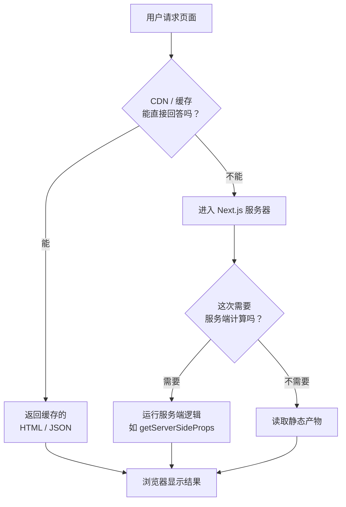
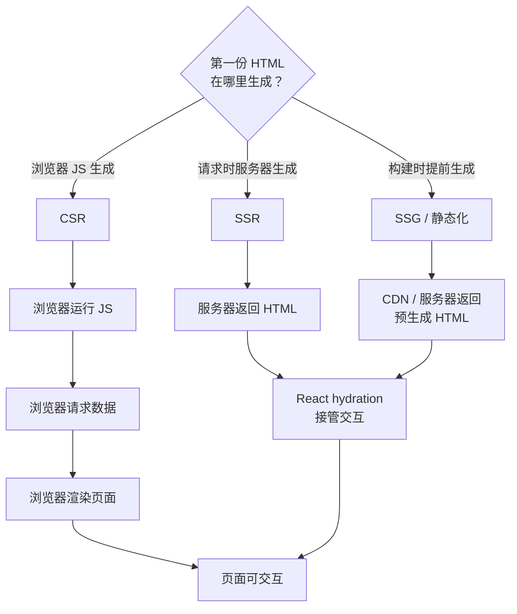
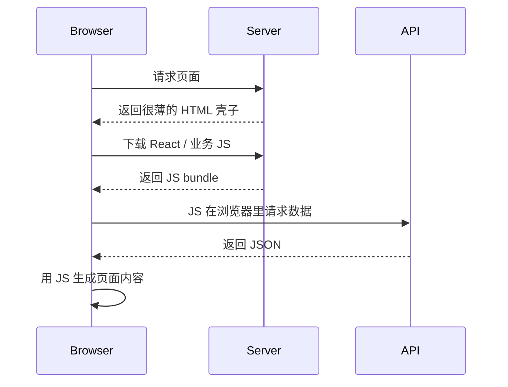
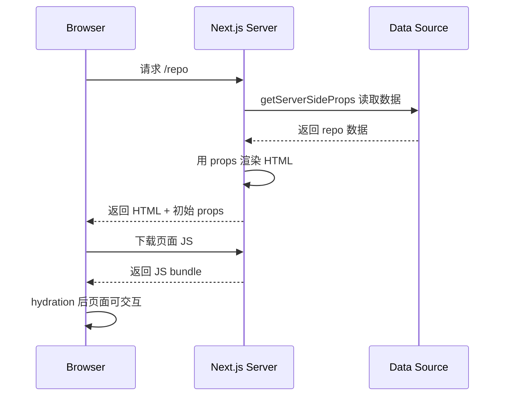
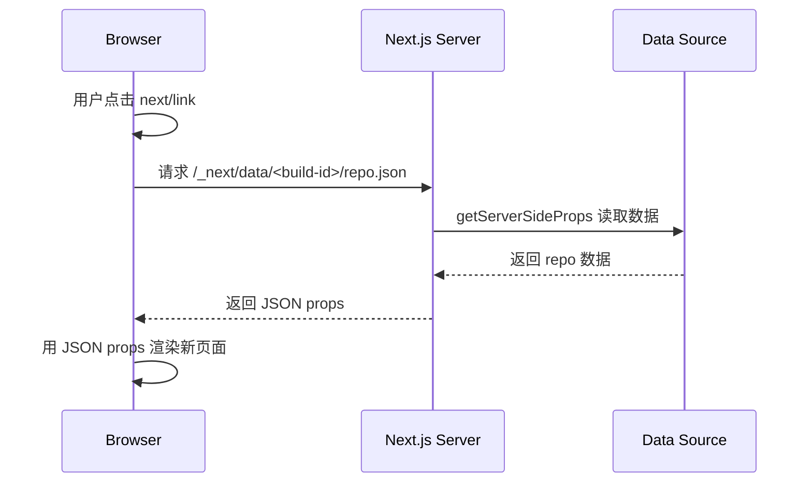
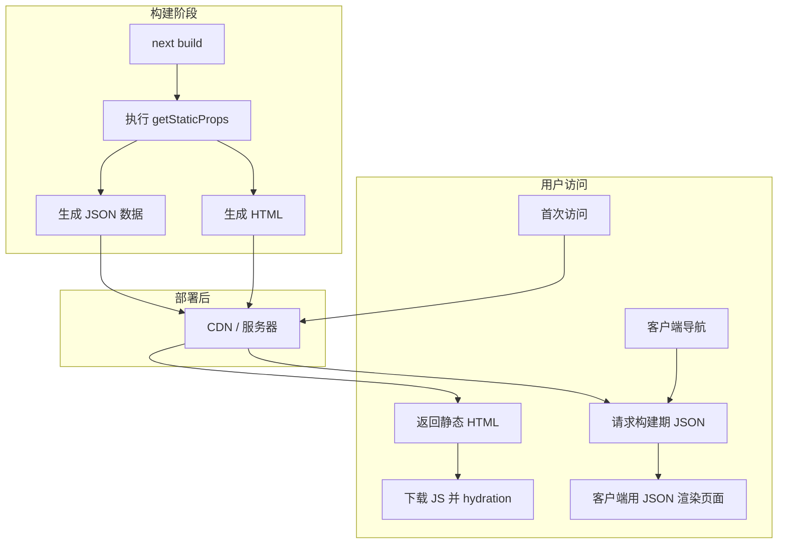
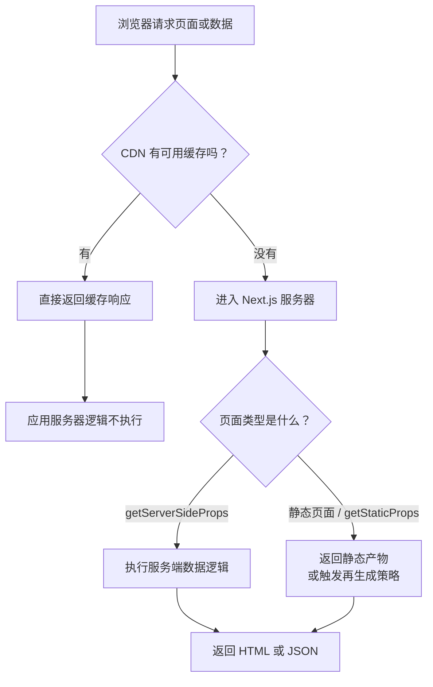
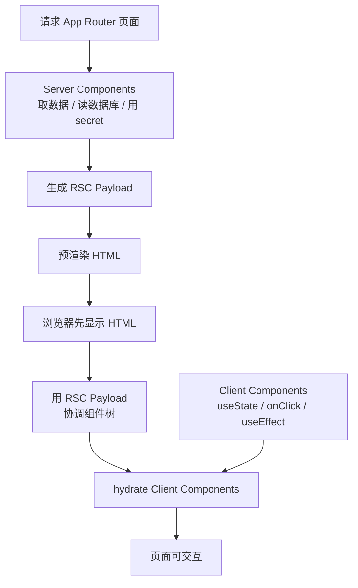
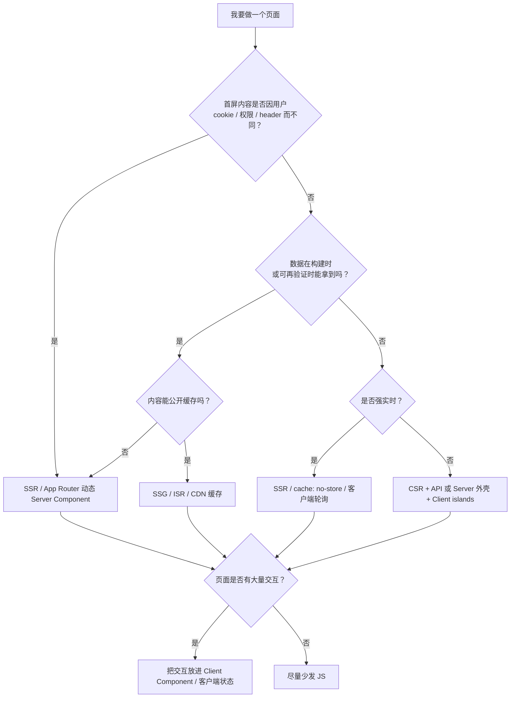

很多人学 Next.js 渲染时，最容易卡在一堆缩写里：SSR、CSR、SSG、ISR、RSC、hydration。每个词单独看都能懂，一放到真实场景里就开始乱：

- `getServerSideProps` 是不是只在首次访问时跑？
- 客户端点 `next/link` 跳过去，还算服务端渲染吗？
- CDN 命中缓存时，服务端代码还会执行吗？
- App Router 里没有 `getServerSideProps`，是不是就没有 SSR 了？
- 为什么服务端已经渲染了 HTML，浏览器还要 hydration？

这些问题用名词解释名词，很容易越绕越晕。更好的办法是回到第一性原理：**一个网页从服务器到浏览器，中间到底传了什么东西？**

## 先建立物理模型：浏览器只能收到三类东西

不管框架怎么包装，浏览器真正能拿到的东西大体只有三类：

1. **HTML**：让用户马上看到页面骨架和内容。
2. **JavaScript**：让页面能响应点击、输入、状态变化。
3. **数据**：可能是 JSON，也可能是 App Router 里的 RSC Payload，用来告诉客户端“页面现在应该长什么样”。

所以判断一种渲染方式，不要先问“它叫 SSR 还是 SSG”，而要问：

- 第一份 HTML 是服务器现算的，还是构建时提前生成的，还是浏览器自己用 JS 生成的？
- 数据是在服务器拿，还是浏览器拿？
- 用户后续跳转时，请求的是新 HTML，还是数据包，还是只改了 URL？

把这三个问题回答清楚，绝大多数 Next.js 渲染问题就顺了。

如果直接把所有分支塞进一张横向图，实际页面里会被压得很小。这里拆成两张纵向图看。

第一张先看：请求有没有真正进入 Next.js 服务器。



第二张再看：第一份 HTML 是谁生成的。



这张图里最重要的分叉不是“名词是什么”，而是“请求有没有到服务器逻辑”“第一份 HTML 是什么时候生成的”。

## CSR：浏览器自己做饭

最朴素的 React 单页应用是 CSR，也就是 Client-Side Rendering。

它的流程大概是：



这种模式的关键是：**第一屏主要靠浏览器 JS 生成**。

优点是交互模型简单，登录后后台、编辑器、复杂工作台很适合。缺点也明显：如果 JS 很大、网络慢、接口慢，用户可能先看到空白、骨架屏或者 loading；搜索引擎和分享预览也不一定能直接拿到完整内容。

CSR 不是“不好”，它只是把更多工作放到了浏览器。对于一个高度交互、SEO 不重要、登录后才可见的页面，这往往是合理选择。

## SSR：服务器先做一份能看的页面

SSR 是 Server-Side Rendering。它的直觉是：**用户请求来了，服务器先把这一页算出来，返回一份已经有内容的 HTML**。

在 Next.js Page Router 里，最典型的入口是 `getServerSideProps`：

```tsx
import type { GetServerSideProps, InferGetServerSidePropsType } from 'next'

type Repo = {
  name: string
  stargazers_count: number
}

export const getServerSideProps = (async () => {
  const res = await fetch('https://api.github.com/repos/vercel/next.js')
  const repo: Repo = await res.json()

  return {
    props: {
      repo,
    },
  }
}) satisfies GetServerSideProps<{ repo: Repo }>

export default function Page({
  repo,
}: InferGetServerSidePropsType<typeof getServerSideProps>) {
  return <main>{repo.stargazers_count}</main>
}
```

首次访问这个页面时，链路是：



这里有两个常被忽略的点。

第一，`getServerSideProps` 跑在服务端，所以里面可以直接访问后端资源，比如 CMS、数据库、内部服务，没必要先绕到自己的 API Route 再调一次。

第二，`props` 会进到客户端可见的初始页面数据里，用来完成 hydration。所以不要把不该暴露的 token、secret、内部权限细节塞进 `props`。服务端能访问秘密，不代表返回给页面的 props 还能继续保密。

## 客户端导航到 SSR 页面：还是会跑服务端

最容易误解的是这一句：**客户端导航不等于纯客户端渲染**。

假设你已经在 `/home`，点击一个 `next/link` 跳到 `/repo`，而 `/repo` 使用了 `getServerSideProps`。这时通常不会整页刷新，浏览器也不一定重新请求完整 HTML。它会发一个 Next.js 的数据请求，形态类似：

```text
/_next/data/<build-id>/repo.json
```

然后服务器执行 `getServerSideProps`，返回 JSON，客户端拿这份 JSON 更新页面。

所以这个场景可以理解成：



它看起来像“客户端跳转”，但数据仍然来自服务端实时执行。这里的“客户端”主要指导航体验：没有整页刷新，React 在当前页面里完成过渡。

这也是很多表格里会把它叫作“SSR 的客户端过渡”的原因。严格说，它不是传统意义上的“重新返回整页 HTML 的 SSR”，但它仍然是服务端参与的数据渲染。

## SSG：提前做好，来了就发

SSG 是 Static Site Generation。它的核心不是“没有服务器”，而是：**这份页面在用户请求之前就已经生成好了**。

Page Router 里常见入口是 `getStaticProps`：

```tsx
import type { GetStaticProps, InferGetStaticPropsType } from 'next'

type Post = {
  title: string
}

export const getStaticProps = (async () => {
  const posts: Post[] = await loadPosts()

  return {
    props: {
      posts,
    },
  }
}) satisfies GetStaticProps<{ posts: Post[] }>

export default function Blog({
  posts,
}: InferGetStaticPropsType<typeof getStaticProps>) {
  return (
    <main>
      {posts.map((post) => (
        <article key={post.title}>{post.title}</article>
      ))}
    </main>
  )
}
```

它的链路是：



所以 SSG 的关键判断是：请求来的那一刻，是否需要重新计算这一页？

如果答案是否定的，SSG 往往比 SSR 更合适。比如博客、营销页、文档页、公开商品详情页，只要内容不是每个用户都不同，就可以优先考虑静态生成，再配合 CDN 或 ISR 处理更新。

## Automatic Static Optimization：没有阻塞数据需求时，Next.js 会自动静态化

在 Page Router 里，如果一个页面没有 `getServerSideProps`，也没有 `getInitialProps`，Next.js 可以自动判断它没有阻塞数据需求，并把它预渲染为静态 HTML。

这就是 Automatic Static Optimization。

直觉上，它回答的是这个问题：

> 这个页面在请求到来之前，能不能先做出来？

如果能，Next.js 就尽量提前做。这样的页面不需要每次请求都进行服务端计算，可以直接从多个 CDN 节点返回，速度通常更好。

但注意：静态页面也不是“死页面”。静态生成的页面仍然会在客户端 hydration，变成可交互的 React 应用。

## Hydration：HTML 先让你看见，JS 再让你能用

服务端已经返回 HTML 了，为什么还需要 hydration？

因为 HTML 本身只有结构和内容，没有 React 的运行时状态，也没有事件处理器。服务端返回的 HTML 可以让用户马上看到：

```html
<button>Like</button>
```

但浏览器不会天然知道这个按钮点击后要执行哪个 React 函数。React 的 JS 下载并执行后，会把事件处理器、状态、组件树和现有 DOM 对上，这个过程就是 hydration。

可以把它理解成：

```text
HTML：先摆好舞台
JavaScript：演员上场，灯光接管，按钮开始能点
```

这也是为什么 Next.js 文档会提醒：传给页面组件的 `props` 会出现在客户端初始 HTML/数据里，用来保证 hydration 正确。服务端渲染不是“代码永远不去客户端”，而是“某些逻辑在服务端执行，执行结果会被送到客户端继续接管”。

## shallow routing：只改地址，不重新拿数据

Page Router 里还有一个容易误判的场景：shallow routing。

比如：

```tsx
import { useRouter } from 'next/router'

export function FilterButton() {
  const router = useRouter()

  return (
    <button
      onClick={() => {
        router.push('/products?sort=price', undefined, { shallow: true })
      }}
    >
      Sort by price
    </button>
  )
}
```

`shallow: true` 的意思是：更新 URL，但不要重新运行当前页面的数据获取函数。也就是说，它不会重新触发 `getServerSideProps`、`getStaticProps` 或 `getInitialProps`。

所以 shallow routing 适合表达“URL 状态变了，但页面数据不需要从服务端重新取”的场景，比如 tab、排序参数、本地筛选条件。它不适合用来表达“query 变了，所以服务端必须重新查数据”的场景。

## CDN 缓存命中：请求甚至可能到不了你的服务器逻辑

再往底层看一层：浏览器请求页面时，请求不一定直接打到 Next.js 服务器。中间可能有 CDN，比如 Vercel Edge Network、Cloudflare 或其他缓存层。

如果命中的是静态 HTML、静态 JSON，或者你为 SSR 响应设置了可缓存的 `Cache-Control`，那么 CDN 可能直接把缓存结果返回给浏览器。

这时服务端代码不会执行。不是因为页面“变成 CSR 了”，而是因为请求在更前面的缓存层已经结束了。

所以判断“服务端是否执行”，要按这条链路看：



这也是很多线上问题的来源：你以为改了服务端逻辑马上会生效，但用户拿到的可能还是缓存响应。

## App Router：不是没有 SSR，而是模型换了

App Router 里没有 `getServerSideProps`。但这不等于 App Router 没有服务端渲染。

它的基本模型是：

- `app/` 下的 layouts 和 pages 默认是 Server Components。
- Server Components 可以在服务端取数据、读数据库、使用不该暴露给浏览器的 token。
- 需要浏览器交互、状态、事件、`useEffect`、`window`、`localStorage` 的地方，用 `'use client'` 标出 Client Component 边界。
- 服务端会生成 RSC Payload，并结合 Client Component 信息预渲染 HTML。
- 首次加载时，HTML 先显示不可交互预览，RSC Payload 用来协调组件树，JS 用来 hydrate Client Components。

这一层最好也画出来：



一个典型写法是：

```tsx
// app/posts/[id]/page.tsx
import { LikeButton } from './like-button'
import { getPost } from '@/lib/data'

export default async function Page({
  params,
}: {
  params: Promise<{ id: string }>
}) {
  const { id } = await params
  const post = await getPost(id)

  return (
    <main>
      <h1>{post.title}</h1>
      <LikeButton likes={post.likes} />
    </main>
  )
}
```

```tsx
// app/posts/[id]/like-button.tsx
'use client'

import { useState } from 'react'

export function LikeButton({ likes }: { likes: number }) {
  const [count, setCount] = useState(likes)

  return (
    <button onClick={() => setCount((value) => value + 1)}>
      {count}
    </button>
  )
}
```

这和 Page Router 的差别在于：Page Router 常常是“页面组件 + 特定数据函数”，比如 `getServerSideProps` / `getStaticProps`；App Router 更像是“默认服务端组件树 + 局部客户端交互岛”。

如果要表达类似 `getServerSideProps` 的“每次请求都取最新数据”，App Router 通常会用服务端 `fetch` 的缓存选项，比如：

```tsx
async function getProjects() {
  const res = await fetch('https://example.com/projects', {
    cache: 'no-store',
  })

  return res.json()
}

export default async function Dashboard() {
  const projects = await getProjects()

  return (
    <main>
      {projects.map((project: { id: string; name: string }) => (
        <p key={project.id}>{project.name}</p>
      ))}
    </main>
  )
}
```

不要把这理解为“App Router 比 Page Router 更 SSR”。更准确的说法是：App Router 把“哪些代码在服务端，哪些代码在客户端”的边界变成组件图的一部分。

## 一张表把常见场景放回链路里

| 场景 | 服务端是否执行页面数据逻辑 | 浏览器拿到什么 | 怎么理解 |
|------|----------------------------|----------------|----------|
| 首次访问 `getServerSideProps` 页面 | 是 | HTML + 初始数据 + JS | 服务端按请求实时生成首屏 |
| `next/link` 跳到 `getServerSideProps` 页面 | 是 | JSON props + JS 已在本地 | 客户端导航体验，服务端仍取数 |
| 首次访问 `getStaticProps` 页面 | 通常否，除非 ISR / fallback 等触发再生成 | 构建期 HTML + JS | 页面提前做好 |
| `next/link` 跳到 `getStaticProps` 页面 | 否 | 构建期 JSON | 客户端使用静态数据产物 |
| 无 `getServerSideProps` / `getInitialProps` 的 Pages 页面 | 否 | 自动静态化 HTML + JS | Next.js 自动预渲染 |
| shallow routing | 否 | URL 变化，本地状态继续 | 只改路由状态，不重新取数据 |
| CDN 命中缓存 | 否 | 缓存的 HTML / JSON | 请求没进入应用服务器逻辑 |
| App Router Server Component 首次加载 | 是，取决于缓存策略 | HTML + RSC Payload + JS | 服务端组件先渲染，客户端组件再 hydrate |
| App Router Client Component 交互 | 否 | 浏览器本地状态变化 | `useState` / 事件处理在客户端 |

## 判断代码跑在哪边的检查表

问自己这几个问题，比背概念更可靠：

1. 代码在 `getServerSideProps` 里吗？
   在的话，它只在服务端运行，但返回的 props 会进入客户端可见数据。

2. 代码在 `getStaticProps` 里吗？
   在的话，它只在服务端/构建或再验证阶段运行，不会进浏览器 bundle。

3. 页面没有 `getServerSideProps` / `getInitialProps` 吗？
   Page Router 可能会自动静态优化。

4. 代码在 App Router 组件里，而且文件没有 `'use client'` 吗？
   默认按 Server Component 理解。

5. 代码用到了 `useState`、`useEffect`、事件处理器、`window`、`localStorage` 吗？
   这些需要 Client Component 或客户端环境。

6. 用户这次访问命中了 CDN 缓存吗？
   命中缓存时，应用服务器逻辑可能完全不执行。

7. 这是 shallow routing 吗？
   是的话，不要期待页面数据函数重新运行。

## 选型不要从名词出发

从第一性原理看，选择渲染方式其实是在分配三种成本：

- **服务器成本**：每次请求是否要计算？
- **浏览器成本**：是否让用户下载更多 JS、在本地做更多事？
- **缓存收益**：这份结果能不能被很多用户复用？

所以可以这样判断：

| 页面类型 | 更自然的选择 | 原因 |
|----------|--------------|------|
| 博客、文档、营销页 | SSG / 静态生成 | 内容可复用，CDN 收益最大 |
| 公开商品详情、价格页 | SSG + ISR 或缓存 | 大部分内容相同，允许延迟更新 |
| 登录后的用户首页 | SSR 或 App Router 动态 Server Component | 用户态、权限、cookie 影响结果 |
| 实时数据强相关页面 | SSR / `cache: 'no-store'` / 客户端轮询 | 请求时信息才可靠 |
| 后台管理、编辑器、复杂工作台 | CSR + API / Server Component 外壳 + Client islands | 交互密集，客户端状态多 |

一句更实用的口诀：

```text
能提前算，就提前算。
能缓存，就缓存。
必须按用户请求算，再 SSR。
必须靠浏览器交互，就放客户端。
```

也可以把它变成一个决策流程：



## 最后的心智模型

Next.js 的核心不是“服务端渲染框架”这么简单，而是一个帮你安排计算位置的框架。

同一个页面里，可以同时有：

- 服务端提前生成的 HTML；
- 构建期生成的 JSON；
- 每次请求实时返回的 props；
- CDN 命中的缓存；
- 浏览器 hydration 后接管的交互；
- App Router 里的 RSC Payload；
- 只在客户端运行的状态和事件。

学习 Next.js 渲染，最重要的不是记住所有缩写，而是每次都把问题还原成：

```text
这段代码什么时候执行？
执行结果传给谁？
传输格式是什么？
结果能不能缓存？
浏览器还需要 JS 做什么？
```

能回答这五个问题，SSR、SSG、CSR、RSC 就不再是一堆名词，而是一条请求链路上的不同分工。
